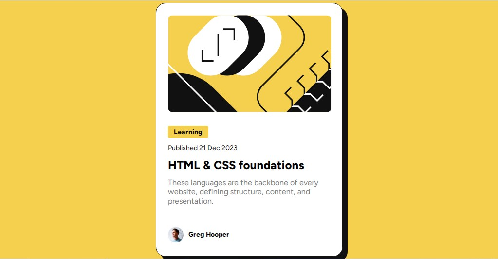

# Frontend Mentor - Blog preview card solution

This is a solution to the [Blog preview card challenge on Frontend Mentor](https://www.frontendmentor.io/challenges/blog-preview-card-ckPaj01IcS). Frontend Mentor challenges help you improve your coding skills by building realistic projects. 

## Table of contents

- [Overview](#overview)
  - [The challenge](#the-challenge)
  - [Screenshot](#screenshot)
  - [Links](#links)
- [My process](#my-process)
  - [Built with](#built-with)
  - [What I learned](#what-i-learned)
  - [Continued development](#continued-development)
- [Author](#author)

## Overview

### The challenge

Users should be able to:

- See hover and focus states for all interactive elements on the page

### Screenshot

### Links

- [Solution URL]: (https://your-solution-url.com)
- [Live Site]: (https://6xg0d.github.io/blog-preview-card-challenge/)

## My process
The HTML coding was pretty easy, but still i took my time to think about how it'd be better to structure the content and being as semantic as possible. This challenge gave a few problems, specially with the margins and spaces. And even when the space between the footer and the paragraph description isn't the same, i'm still happy with this result. 

### Built with

- Semantic HTML5 markup
- CSS
- Flexbox

### What I learned

With this project i was able to practice a little bit more of flexbox, and explore a little bit more about Figma and how to use it.

### Continued development

I want to work more with Figma, improve my CSS skills and be able to positionate elements exactly where i want. Planning to add even more interactivity in the future to this card preview!

## Author
- Frontend Mentor - [@6xg0d](https://www.frontendmentor.io/profile/6xg0d)
